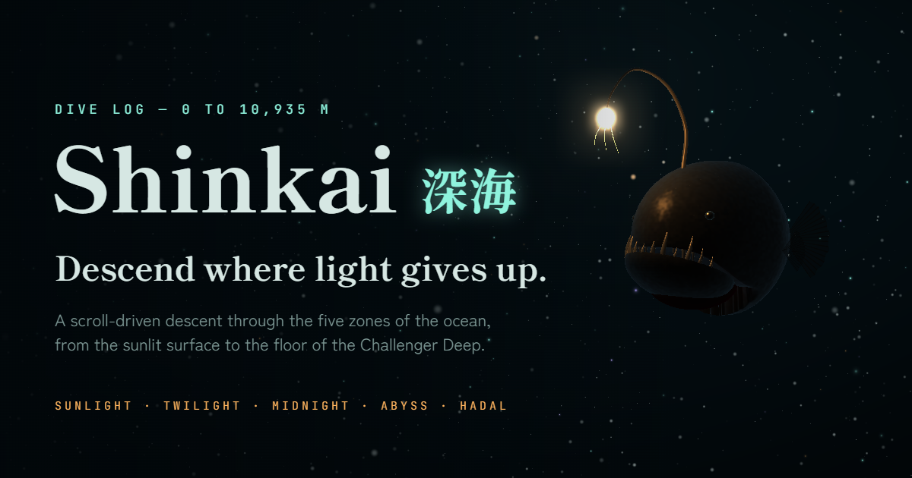

# Shinkai 深海

A scroll-driven descent through the five zones of the ocean, from the sunlit surface to the floor of the Challenger Deep at 10,935 m, rendered live in Three.js.

[**View the live project**](https://wqryx.github.io/shinkai/) · [**View the source**](https://github.com/wqryx/shinkai)



## What it does

- Sinks the reader through five chapters as the page scrolls: sunlight, twilight, midnight, abyss and the hadal trenches, ending on the floor of the Challenger Deep.
- Keeps a live depth gauge with pressure, water temperature and remaining sunlight, plus reference points along the way: the deepest scuba dive, a sperm whale's hunt, the Titanic, Japan's Shinkai 6500 and the height of Everest.
- Fills each zone with its own procedural creature: pulsing moon jellies, a schooling lanternfish shoal that scatters from the cursor, an anglerfish that stalks and bites when you hold the cursor on its lure, a tripod fish standing on the abyssal plain, a translucent hadal snailfish with its organs showing, and the bathyscaphe Trieste resting at the bottom.
- Turns the cursor into the only light source in the deep zones; on touch screens a press-and-hold does the same and the anglerfish strikes on its own.
- Synthesises an ambient soundtrack in the browser that grows darker with depth: water, a sinking pressure drone, sonar pings and hull creaks.
- Ships in English and Spanish, with an autopilot "Start the dive" mode, a responsive mobile layout and reduced-motion behaviour.

## How it is made

Shinkai is a deliberately small static site. `index.html` contains the document structure, CSS, copy in both languages, the depth model, the sound engine and the whole Three.js scene. There is no build step, package manager or framework.

Nothing in the scene is a downloaded model or texture. The water column, god rays and marine snow are shader-driven point clouds and full-screen passes. Every creature is built at runtime from deformed spheres, lathes and tapered tubes, with eyes, fins and teeth seated on the body by casting rays at it, then shaded with one shared organic material that handles velvet skin, scales, translucency and fin rays. The anglerfish is lit only by its own lure; everything below the midnight zone is lit only by the reader's cursor. A bloom pass and a pressure pass (a slight waver, chromatic split and closing vignette) sit on top.

## Run locally

From the repository root, run:

```bash
python3 -m http.server 4173 --bind 127.0.0.1
```

Then visit [http://127.0.0.1:4173/](http://127.0.0.1:4173/).

Python is only used to serve the static files; any static server works. The page loads Three.js r160 from jsDelivr and its typefaces from Google Fonts, so it needs a network connection. If WebGL or the CDN is unavailable it falls back to a lighter 2D canvas sea.

## Project structure

```text
shinkai/
├── index.html   # the whole experience: markup, styles, copy, sound and 3D scene
├── og.png       # share card, 1200 × 630, rendered from the live scene
└── README.md
```

## Design and attribution

Shinkai is an original, independent design study inspired by the structure and atmosphere of [Kage](https://mengto.github.io/kage/) by Meng To. It is not affiliated with JAMSTEC, the U.S. Navy or any expedition named on the page.

Depths, pressures, temperatures and records are rounded, commonly cited figures; pressure is estimated as 1 atm per 10 m of seawater plus the atmosphere. Three.js is © three.js authors and used under the MIT license; the typefaces are Shippori Mincho B1, Zen Kaku Gothic New and JetBrains Mono, served by Google Fonts under the SIL Open Font License.

## En español

Shinkai es un descenso por las cinco zonas del océano, desde la superficie iluminada por el sol hasta el fondo del Abismo Challenger, a 10.935 m, dibujado en tiempo real con Three.js. Al hacer scroll te hundes: un medidor marca la profundidad, la presión, la temperatura y la luz que queda, y cada zona tiene su criatura, desde medusas y peces linterna hasta un rape abisal que muerde, un pez trípode, un pez caracol translúcido y el batiscafo Trieste posado en el fondo. En las zonas oscuras tu cursor es la única luz. La página está en inglés y en español, tiene sonido ambiente generado en el navegador y un modo de descenso automático.

[**Ver la web**](https://wqryx.github.io/shinkai/)

## License

No license is currently granted for reuse or redistribution of the original Shinkai code or share artwork. Three.js and the fonts remain covered by their own licenses.
